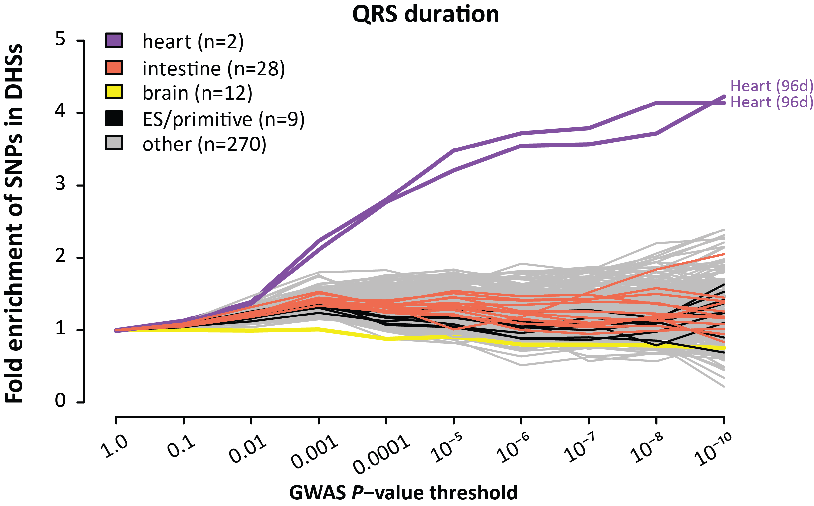

#GWAS_plots
Performs enrichment plots of GWAS p-value lists in DHSs (like Fig. 5 of Maurano, Humbert, et al. Science 2012)

#Requirements: 
<ul><li><a href="http://bedops.readthedocs.org">BEDOPS</a>
<li>perl
<li>R with ggplot installed
<li>DHS master list. Due to github limits on file sizes, you will need to download namedFDR5pctHotspots.starch from http://www.uwencode.org/proj/Science_Maurano_Humbert_et_al/data/namedFDR5pctHotspots.starch and place it in the hg19 folder.
</ul>

#Example usage
<pre>cd src
perl ./gwasVsRegions.pl -p pvalues.hg19.YOURSTUDY.bed5 -s ../hg19/namedFDR5pctHotspots.starch -r ../results_hotspots_nocoding</pre>

#Input format
The GWAS P-value file is a tab-delimited file provided by the user. It includes the dbSNP ID in column 4, and the P-value in column 5; only the latter is actually used.

#Details
The two key scripts are in src. The pipeline is divided into a Perl script which processes the overlap, and then a second script which does the plotting in R: 
<ol><li>gwasVsRegions.pl runs the overlap of the p-value file with the DHS master list 

The intermediate results go into results_hotspots_nocoding/YOURSTUDY. There is one text file per cell type, though you can see at the end of a Perl script I put all of these together into a single file before plotting.

namedFDR5pctHotspots.starch is a starch archive (see BEDOPS) containing the DHS master list.

Samples listed in excluded_samples.txt will be ignored

(This script was written by Eric Haugen, UW)

<li>doGWASPlot.R is the plotting script. 
It is invoked automatically at the end of the overlap script.

You can see that right now only the x-axis upper limit and of the number of cell types to label are parameterized on the command line. If you look inside, you'll see that the legendSamples list maps samples to group names and colors using regexp.

This could be easily parallelized by chromosome.

Key variables for each plot need to be optimized by the user: 
<ul><li> which samples to display on the plot
<li> what the labels to give each sample and how to color them (only the top N samples get labels)
<li>The sample groups and labels (i.e. endothelia, muscle, fetal, etc.)
<li>adjusting the range of the X and Y axes
<li>plot title
</ul>
</ol>
